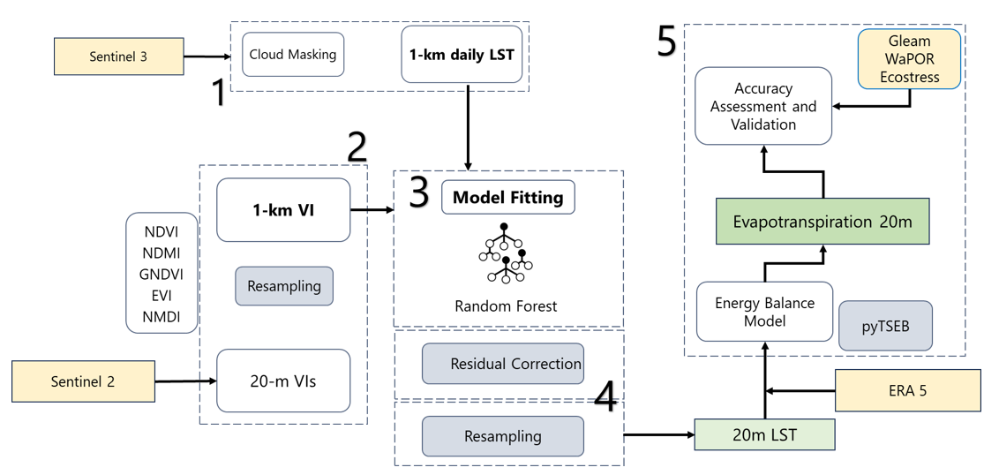

# High-Resolution Evaportranspiration Estimation
Based on the review of state-of-the-art methods to estimate ET using Sentinel-3 the following processing chain was developed for Land Surface Temperature (LST) downscaling and Evapotranspiration (ET) estimation.

For more information, please reach out to the following paper: https://doi.org/10.1109/IGARSS53475.2024.10642707
